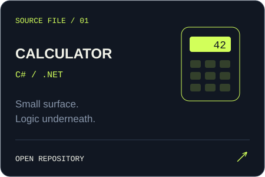
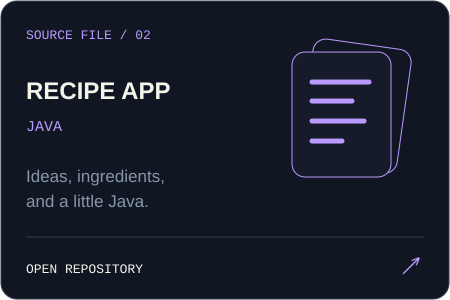
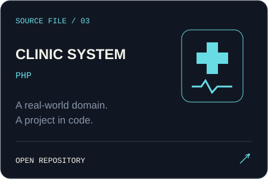
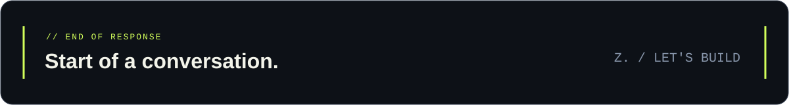

<div align="center">



**[The developer](#01--the-developer)** &nbsp; / &nbsp; **[The toolkit](#02--the-toolkit)** &nbsp; / &nbsp; **[The source](#03--the-source)** &nbsp; / &nbsp; **[Get in touch](#05--open-a-channel)**

<br>

`C# & .NET` &nbsp; · &nbsp; `Object-Oriented Programming` &nbsp; · &nbsp; `Problem Solving`

</div>

<br>

## 01 / The developer

### You see the response. I care about what happens before it.

I'm **Ziad Elmaghraby**, a software engineering student focused on **backend development with C# and .NET**. I enjoy taking a problem apart, understanding its moving pieces, and turning them into code.

This is my little corner of the source: projects, coursework, and a record of what I'm building along the way.

```csharp
// A developer, expressed in C#.
var developer = new
{
    Name      = "Ziad Elmaghraby",
    Role      = "Software Engineer",
    Focus     = "Backend .NET",
    Mindset   = "Understand it. Build it. Improve it.",
    FindMe    = "github.com/ZiadMaghraby"
};
```

<br>

## 02 / The toolkit

| Layer | What's inside |
| :--- | :--- |
| **Primary focus** | **C# · .NET** — my backend development direction. |
| **Foundations** | Object-oriented programming · problem solving. |
| **Other project languages** | Java · PHP. |
| **Version control** | Git · GitHub. |

<br>

## 03 / The source

**Three projects. Three different corners of my code.**

<table>
<tr>
<td width="33%"><a href="https://github.com/ZiadMaghraby/calculator"></a></td>
<td width="33%"><a href="https://github.com/ZiadMaghraby/recipeApp"></a></td>
<td width="33%"><a href="https://github.com/ZiadMaghraby/clinic_system"></a></td>
</tr>
</table>

<details>
<summary><strong>Open the workbench — coursework & foundations</strong></summary>

<br>

| Source | Focus |
| :--- | :--- |
| [OOP / Assignment 01](https://github.com/ZiadMaghraby/ZiadMaghraby-OOP-Assignment-1) | Object-oriented programming coursework. |
| [OOP / Assignment 03](https://github.com/ZiadMaghraby/ZiadMaghraby-OOP-Assignment-3) | More object-oriented programming practice. |
| [Git / Assignment 01](https://github.com/ZiadMaghraby/ZiadMaghraby-Assignment-1-Git) | Repository workflows and version control. |

</details>

<p align="right"><a href="https://github.com/ZiadMaghraby?tab=repositories"><strong>Browse the full source →</strong></a></p>

<br>

## 04 / The practice loop

```text
    understand ──→ break it down ──→ write code
         ↑                              │
         └──────── learn & refine ←─────┘
```

Different problems, the same curiosity. Find my problem-solving profiles on **[LeetCode ↗](https://leetcode.com/u/ZiadMaghraby/)** and **[Codeforces ↗](https://codeforces.com/profile/ZiadMaghraby)**.

<details>
<summary><strong>Inspect GitHub activity</strong></summary>

<br>

<p align="center">


</p>

[View contribution history](https://github.com/ZiadMaghraby?tab=overview)

</details>

<br>

## 05 / Open a channel

Have a project, a question, or an interesting backend problem? **Let's talk.**

**[LinkedIn ↗](https://www.linkedin.com/in/ziadmaghraby/)** &nbsp; · &nbsp; **[Send an email ↗](mailto:ziadelmaghraby0@gmail.com)**

`ziadelmaghraby0@gmail.com`

<br>


