


**[THE DEVELOPER](#the-developer)** &nbsp; / &nbsp; **[THE SOURCE](#the-source)** &nbsp; / &nbsp; **[THE PRACTICE](#the-practice)** &nbsp; / &nbsp; **[CONTACT](#contact)**



**You see the response. I care about what happens before it.**

I’m **Ziad Elmaghraby**, a software engineering student focused on **backend development with C# and .NET**. I enjoy taking problems apart, understanding their moving pieces, and turning them into code. This profile is a window into my projects, coursework, and progress.


<a href="https://github.com/ZiadMaghraby/calculator"></a>
<a href="https://github.com/ZiadMaghraby/recipeApp"></a>
<a href="https://github.com/ZiadMaghraby/clinic_system"></a>

<a href="https://github.com/ZiadMaghraby/calculator">Calculator · C#</a> &nbsp; / &nbsp; <a href="https://github.com/ZiadMaghraby/recipeApp">Recipe App · Java</a> &nbsp; / &nbsp; <a href="https://github.com/ZiadMaghraby/clinic_system">Clinic System · PHP</a>

<strong>＋ Open the workbench — coursework & foundations</strong>

| Source | Focus |
| :--- | :--- |
| [OOP / Assignment 01](https://github.com/ZiadMaghraby/ZiadMaghraby-OOP-Assignment-1) | Object-oriented programming coursework. |
| [OOP / Assignment 03](https://github.com/ZiadMaghraby/ZiadMaghraby-OOP-Assignment-3) | More object-oriented programming practice. |
| [Git / Assignment 01](https://github.com/ZiadMaghraby/ZiadMaghraby-Assignment-1-Git) | Repository workflows and version control. |

<a href="https://github.com/ZiadMaghraby?tab=repositories"><strong>EXPLORE ALL REPOSITORIES →</strong></a>



<strong><a href="https://leetcode.com/u/ZiadMaghraby/">LEETCODE ↗</a> &nbsp; / &nbsp; <a href="https://codeforces.com/profile/ZiadMaghraby">CODEFORCES ↗</a></strong>

<strong>＋ Inspect GitHub activity</strong>

[View contribution history](https://github.com/ZiadMaghraby?tab=overview)


Have a project, a question, or an interesting backend problem? **Let’s talk.**

<a href="https://www.linkedin.com/in/ziadmaghraby/"></a>
<a href="mailto:ziadelmaghraby0@gmail.com"></a>

ziadelmaghraby0@gmail.com

