

<picture>
<source media="(max-width: 600px)" srcset="./identity-mobile.svg">
</picture>

**Choose a route into my world.**

<a href="#the-developer"></a>
<a href="#the-stack"></a>
<a href="#the-source"></a>

[The practice](#the-practice) &nbsp; / &nbsp; [Get in touch](#contact)

**You see the response. I care about what happens before it.**

I’m **Ziad Elmaghraby**, a software engineering student focused on **backend development with C# and .NET**. I enjoy taking problems apart, understanding their moving pieces, and turning them into code. My learning spans C#, data access, MVC and APIs, Domain-Driven Design, and the foundations of cloud delivery. This profile brings together that learning and the public projects I can share.


### What I’ve learned

A visual map of the subjects I’ve studied through my .NET development learning journey.


<strong>＋ Read the complete learning map</strong>

| Area | Topics studied |
| :--- | :--- |
| Getting started | Orientation; Git & GitHub. |
| C# & design | C# basics; advanced C#; OOP; SOLID; testing; LINQ. |
| Databases & data access | SQL; NoSQL; ADO.NET; Dapper; Entity Framework. |
| Application development | .NET fundamentals; MVC and its project track; APIs. |
| Architecture & domains | Domain-Driven Design; logistics SaaS concepts; introductory microservices. |
| Cloud & delivery | Azure fundamentals; deployment strategies; CI/CD. |
| Team projects | Agile teamwork and graduation project practices. |

Java and PHP also appear in my public projects.

<a href="https://github.com/ZiadMaghraby/calculator">Calculator · C#</a> &nbsp; / &nbsp; <a href="https://github.com/ZiadMaghraby/recipeApp">Recipe App · Java</a> &nbsp; / &nbsp; <a href="https://github.com/ZiadMaghraby/clinic_system">Clinic System · PHP</a>

<strong>＋ Open the workbench — coursework & foundations</strong>

| Source | Focus |
| :--- | :--- |
| [OOP / Assignment 01](https://github.com/ZiadMaghraby/ZiadMaghraby-OOP-Assignment-1) | Object-oriented programming coursework. |
| [OOP / Assignment 03](https://github.com/ZiadMaghraby/ZiadMaghraby-OOP-Assignment-3) | More object-oriented programming practice. |
| [Git / Assignment 01](https://github.com/ZiadMaghraby/ZiadMaghraby-Assignment-1-Git) | Repository workflows and version control. |

<a href="https://github.com/ZiadMaghraby?tab=repositories"><strong>EXPLORE ALL REPOSITORIES →</strong></a>

<strong><a href="https://leetcode.com/u/ZiadMaghraby/">LEETCODE ↗</a> &nbsp; / &nbsp; <a href="https://codeforces.com/profile/ZiadMaghraby">CODEFORCES ↗</a></strong>

<strong>＋ Inspect GitHub activity</strong>

[View contribution history](https://github.com/ZiadMaghraby?tab=overview)

<strong>⌁ There’s a comment hidden behind the code.</strong>


Have a project, a question, or an interesting backend problem? **Let’s talk.**

ziadelmaghraby0@gmail.com

